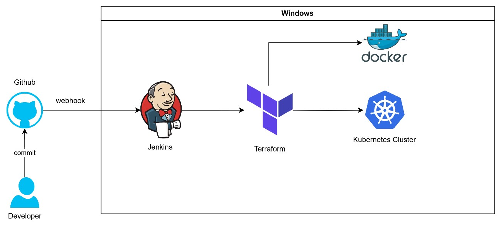

Daniel Velasquez

Flujo y diseño CI/CD despliegue de aplicativo Python a Kubernetes

Explicación: 
1.	developer realiza un push a un repositorio github.
2.	Github dispara a través de un webhook, el pipeline a través de Jenkins.
3.	Jenkins a través de “stages” arma la imagen en Docker, realiza push a dockerhub y ejecuta terraform para el despliegue del aplicativo al cluster de Kubernetes.
4.	Terraform se encarga de la creación de servicios, namespaces, mapear el provider (KUbernetes cluster de Docker Desktop). Se realiza terraform init, plan y apply.

Pruebas de ejecución paso a paso:

 
**Validar documento "Documentacion.pdf"

Repositorio publico de la solución:

<https://github.com/danielvh01/devops-python.git>

